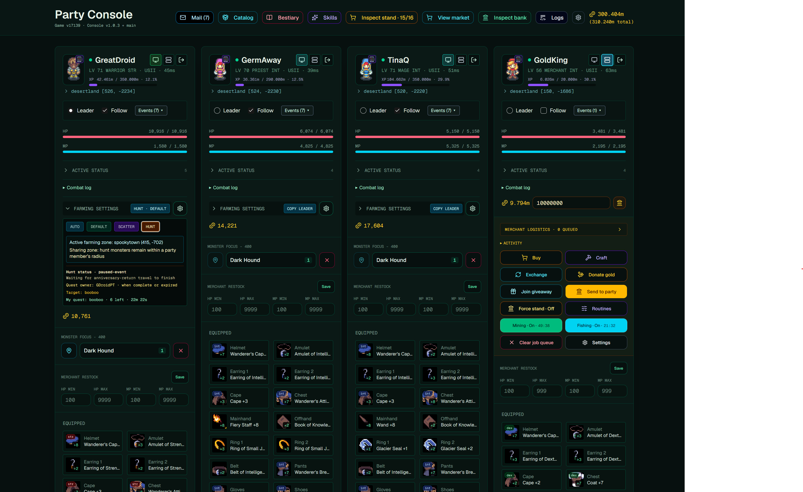

# Adventureland Party Console

For editable Windows packages, Docker images, release publishing, and dashboard-managed updates, see [Distribution and updates](docs/distribution.md).

Run Adventure Land characters in Steam or headless, and manage them from a browser.



## Windows installation

### Release package (recommended; supports automatic updates)

1. Download the Windows x64 ZIP from [GitHub Releases](https://github.com/Ryan-Haines/adventureland-party-console/releases/latest).
2. Extract it to a writable folder and double-click **`Start.cmd`**. Keep the console window open. First startup prepares its private Node runtime; you do not need to install Git or Node separately.
3. Open [http://localhost:3010](http://localhost:3010). A fresh installation automatically opens setup to connect your game account and Steam/browser clients, or select characters for headless play. It needs its own account setup even if you previously configured another installation on the same computer. Internal dashboard ports redirect to this public entry point.
4. In settings, enable **Automatically download and install new versions when available** if desired. Updates download while running and wait for **Restart now**. When you stop the console and start it again through `Start.cmd`, enabled automatic updates install before characters start. After a successful update, the displayed version changes and the green **!** disappears unless another newer release exists.

Use `Start.cmd` from the extracted release ZIP. The repository's `distribution/Start.cmd` is a packaging template and cannot turn a Git checkout into a managed installation. Local application edits can block installation until reconciled. Keep the package's `data` folder: it contains your settings and credentials. Before moving from an existing source installation, preserve its data and stop it; do not run both installations for the same characters. See [Distribution and updates](docs/distribution.md) for installation details.

### Source checkout (development; manual updates)

Use this option to work on the code. These launchers provide update notifications only; switching Git branches does not enable automatic installation.

Install Git and Node **22.18+**. Run these commands in PowerShell.

1. Clone the repository:

   ```powershell
   git clone https://github.com/Ryan-Haines/adventureland-party-console.git
   cd adventureland-party-console
   ```

2. Install dependencies and caracAL:

   ```powershell
   .\scripts\setup-console.ps1
   ```

3. Start the console and leave it running:

   ```powershell
   .\scripts\start-console.ps1
   ```

   You only need to connect your account once. In the **Adventure Land Steam client**, log in to a character, open **CODE**, paste the following line, and click **Engage**. Copy the displayed session into the PowerShell prompt:

   ```javascript
   show_json(parent.user_id + "-" + parent.user_auth)
   ```

4. Open [http://localhost:3010](http://localhost:3010), then **Interface settings > Load setup**. Your account is already connected through the launcher. Setup asks where and how you play Adventure Land, then shows you the right steps to link it. Some setups include a one-time security certificate installation on the computer running the game. For headless play, you can skip linking and continue to the dashboard.
5. Select your characters in the dashboard and play!
6. Optional: [set up ALData](#optional-aldata-setup) to publish market classifieds.

From another computer, use `http://<host-LAN-IP>:3010`. Setup generates the appropriate loader address. Allow Party Console's HTTP (3010) and HTTPS (3443) ports through the host's firewall on your private network.

## Docker installation

### Release deployment (supports automatic updates)

Download **`compose.yaml` from the GitHub release assets** into a deployment folder, then run:

```sh
docker compose up -d
```

This release file includes the updater service needed for the dashboard's automatic-update setting. Keep that service and its `AL_UPDATER_URL` configuration. The repository's Compose files and `start-docker.sh` do not include managed release updates. See [Docker distribution instructions](docs/distribution.md#docker), especially before migrating an existing installation: preserve its Compose project name and data volume.

### Source deployment (development or local builds; manual updates)

Install Git and Docker with Compose. Raspberry Pi requires a **64-bit OS**.

1. Clone the repository:

   ```sh
   git clone https://github.com/Ryan-Haines/adventureland-party-console.git
   cd adventureland-party-console
   ```

2. Build the image; this installs dependencies automatically. If you get an error make sure you have installed the docker compose plugin

   ```sh
   ./scripts/start-docker.sh
   ```

   The helper script builds and starts the container with hot reload enabled. Dashboard and character-code edits update automatically. It waits up to five minutes for startup, then prints **Party Console ready! Open at** followed by your server address. Your saved account, character data, and HTTPS certificates are preserved when you run it again.

3. If you prefer a production container without hot reload, use these commands instead:

   ```sh
   docker compose build
   docker compose up -d
   ```

   These commands also switch an existing development container to production. To switch back, run `./scripts/start-docker.sh`. Both modes use the same saved data. View logs with `docker compose logs -f`; stop the container with `docker compose down`. Do not add `-v` unless you intend to delete your saved data.

4. Open the address printed by the helper. With the manual commands, open [http://localhost:3010](http://localhost:3010), or `http://<host-LAN-IP>:3010` from another computer. Setup first walks you through getting your game session and connecting your account. It then asks where and how you play Adventure Land and shows you the right steps to link it. Some setups include a one-time security certificate installation on the computer running the game. For headless play, you can skip linking and continue to the dashboard. You can revisit these steps through **Interface settings > Load setup**.
5. Select offline characters in the dashboard to run headless, and play!
6. Optional: [set up ALData](#optional-aldata-setup).

## Linux installation

### Linux terminal

Use a **64-bit Linux system (x64 or arm64)**, including a Raspberry Pi with a 64-bit OS. Install Node **22.18+**, npm, Git, tar, and util-linux (which provides `flock`). Run the launcher as your normal user, without `sudo`.

1. Clone the repository:

   ```sh
   git clone https://github.com/Ryan-Haines/adventureland-party-console.git
   cd adventureland-party-console
   ```

2. Start the console and leave the terminal open:

   ```sh
   ./scripts/start-console.sh
   ```

   The first launch installs dependencies, caracAL, and the HTTPS service, then builds the console. Later launches reuse them and reinstall dependencies when their package files change. Dashboard and character-code hot reload are enabled by default.

3. Open a **Dashboard** address printed in the terminal. Setup walks you through getting your game session, connecting your account, and linking your game client. Any certificate installation is part of that guided setup. For headless play, skip linking and select your characters in the dashboard. You can return through **Interface settings > Load setup**.

4. Press **Ctrl+C** in the terminal to stop. Run `./scripts/start-console.sh` again to restart; your account, settings, and certificates are kept. To run without hot reload, use `./scripts/start-console.sh --production` instead.

From another computer, use the printed LAN address. Allow HTTP (3010) and HTTPS (3443) through the host's firewall on your private network. Keep the old console stopped when moving between machines.

## Optional ALData setup

ALData provides public market and Ponty listings without a key. Authentication lets you publish WTS/WTB classifieds. No separate ALData container is needed.

1. Open **Settings → ALData** and click **Generate key**.
2. Click **Prepare mail**, review the gold postage, and send it.
3. Wait about a minute, then click **Check status**. `CORRECT` means setup is complete.

## Making changes

- **Dashboard:** `dashboard/`.
- **Character logic:** `runtime/characters/`; legacy shared routines are in `characters/shared.js`.
- **Generated role compatibility bundle:** `characters/roles.js` is built from `runtime/characters/roles/compat.ts`; edit the TypeScript source. `characters/shared.js` is still maintained source used by current character builds.
- **Coordinator:** `runtime/coordinator/`. Read its [README](runtime/coordinator/README.md) before changing behavior.

For Windows development, start with `.\scripts\start-console.ps1 -DevDashboard`. Dashboard edits reload automatically; character edits rebuild and publish automatically. Edit source files, not generated bundles.

For a full Windows rebuild and publication, stop the launcher and rerun `.\scripts\start-console.ps1`. For coordinator-only changes, use `.\scripts\start-console.ps1 -CoordinatorOnly`; this rebuilds and restarts services while preserving installed character assets.

For native Linux development, use `./scripts/start-console.sh`. Dashboard and character edits reload automatically. After coordinator, hosting, or dependency changes (including a `git pull` containing them), press Ctrl+C and run it again to rebuild and restart. The launcher does not automatically restart the coordinator during gameplay.

For Docker, `./scripts/start-docker.sh` enables hot reload using `compose.dev.yaml`. Edit files in the checkout on the Docker host, directly or through VS Code Remote SSH. Changes in a separate Windows checkout do not automatically reach your Pi.

- **Dashboard or character logic:** save your edits (or pull those changes) and let the watchers update them. No container rebuild is needed. A character build that fails validation leaves the previous version running.
- **Coordinator or hosting code:** rerun the helper to build and restart the services. Coordinator changes do not restart gameplay automatically.
- **Dependencies, Dockerfile, or Compose configuration:** rerun the helper to rebuild the image and refresh its development dependencies.

The helper keeps dependencies and build caches in Docker volumes, separate from your checkout and saved game data. Its restart briefly interrupts console services. If file changes are not detected on a Docker Desktop bind mount, start with `AL_WATCH_POLL=1 ./scripts/start-docker.sh`.

For the production container, rebuild and restart after changes:

```sh
docker compose up -d --build
```

## Moving dashboard state

State is local data; cloning or pushing Git does not transfer it.

| Installation | State file |
| --- | --- |
| Windows/local | `.caracal/localStorage/caraGarage.jsonl` inside the checkout |
| Native Linux | `.build/hosting-data/localStorage/caraGarage.jsonl` by default; an existing `.caracal/localStorage` directory is preserved and used if present |
| Docker | `/data/localStorage/caraGarage.jsonl` inside the container |

1. Stop the old installation and copy its state file. Keep the original as a backup.
2. Start the destination with the **same Adventure Land account**.
3. Open **Settings → Import dashboard state**, choose the copied file, review the settings groups, and import.

To copy the file from Docker:

```sh
docker compose stop
docker compose cp party-console:/data/localStorage/caraGarage.jsonl ./caraGarage.jsonl
```

Import replaces the listed settings groups and creates a backup automatically. It transfers settings and marks, not credentials or running jobs. Keep the old coordinator stopped; generate a new Steam loader for the destination.

## Licenses

Original code is [MIT licensed](LICENSE). Dependencies retain their own licenses; see [third-party notices](THIRD_PARTY_NOTICES.md). Adventure Land game files remain governed by their upstream terms.
